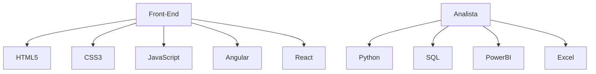

 Soy un desarrollador de software junior con enfoque en el desarrollo web, backend y análisis de datos. Me apasiona convertir ideas en soluciones tecnológicas funcionales, escalables y orientadas al usuario.
En el desarrollo web, trabajo con tecnologías como **Laravel y PHP**, integrando lógica del lado del servidor con bases de datos relacionales como **MySQL y SQL**, para construir aplicaciones robustas. Además, utilizo **HTML**, **JavaScript** y **Java** para dar vida a interfaces dinámicas y eficientes.
En el área de análisis de datos, he desarrollado habilidades con **Python**, en especial con la librería **Pandas**, para procesar y transformar datos, y utilizo **Power BI** para construir dashboards e informes visuales que apoyan la toma de decisiones estratégicas.
También he trabajado con **WordPress** en la personalización de sitios web, lo que me permite entregar soluciones funcionales con tiempos de desarrollo reducidos. 

## 🚀 Tecnologías que manejo

- 🧩 **Lenguajes y frameworks:** Laravel, PHP, Java, JavaScript, HTML, Python
- 🛠️ **Bases de datos:** MySQL, SQL
- 📊 **Análisis de datos:** Pandas, Power BI
- 🌐 **CMS y sitios web:** WordPress


<!----------------------------------------------------------------------------------------------------------------------------------------------------------->

[](https://github.com/ashutosh00710/github-readme-activity-graph)

<!------------------------------------------------------------------------------------------------------------------------------------------------------------>

<div align="center">  
   
  
  
</div>


 <!------------------------------------------------------------------------------------------------------------------------------------------------------------>


 <p align="center">
    <br/><br/><a href="https://www.linkedin.com/in/Heider Palmett" target="_blank"></a>
    <a href="https://www.instagram.com/Heider Palmett/" target="_blank"></a>
    
</p>

 <!------------------------------------------------------------------------------------------------------------------------------------------------------------>


<div align="center">
<div align="center">
<a href="https://facebook.com/Heider Palmett" target="_blank"></a>

<a href="https://www.youtube.com/Heider Palmett" target="_blank"></a> 
<a href="https://www.tiktok.com/Heider Palmett" target="_blank"></a>

<!------------------------------------------------------------------------------------------------------------------------------------------------------------>


---

#### Opción 2: Unir ambos en un solo diagrama

Si prefieres mostrar todo en un solo gráfico, puedes integrarlos así:


<!------------------------------------------------------------------------------------------------------------------------------------------------------------>

```mermaid
graph TD;
    Back-End-->Java;
    Back-End-->NodeJs;
    Back-End-->PHP;
    PHP-->Laravel;
 ```
<!------------------------------------------------------------------------------------------------------------------------------------------------------------>

 
     
   
  
  
  
   
   
 

<!------------------------------------------------------------------------------------------------------------------------------------------------------------>

<!------------------------------------------------------------------------------------------------------------------------------------------------------------>

<table style="width:100%">
<tr>
<td>
<a href="https://www.youtube.com/watch?v=ZZYZ0zEHfPw&t=279s&ab_channel=Marhuire%E2%99%AA">

</a>
</td>
<td>
<a href="https://www.youtube.com/watch?v=wtm9ElrhI_A&ab_channel=Marhuire%E2%99%AA">

</a>
</td>
<td>
<a href="https://www.youtube.com/watch?v=wtm9ElrhI_A&ab_channel=Marhuire%E2%99%AA">

</a>
</td>
</tr>
<tr>
</table>

<!------------------------------------------------------------------------------------------------------------------------------------------------------------>


   
  
    
    


